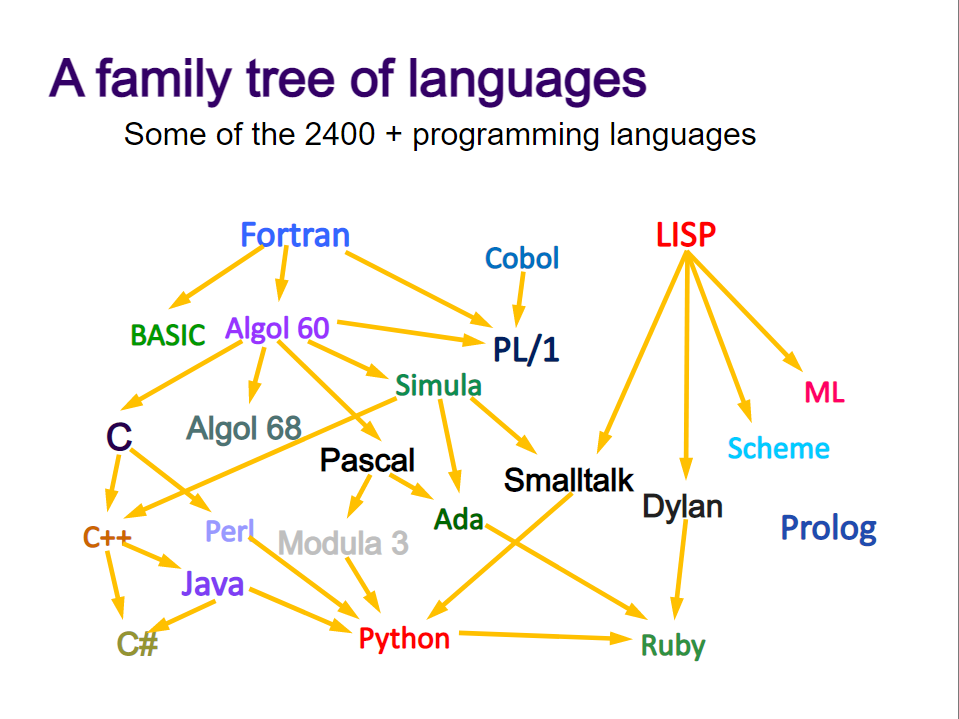

# Guia para Caracterização de Linguagens de Programação

+ Linguagem de Programação: Java

  * [Apresentação e histórico](#apresenta--o-e-hist-rico)
  * [Características da Linguagem](#caracter-sticas-da-linguagem)
  * [Capacidades da Linguagem](#capacidades-da-linguagem)
  * [Produtividade do Desenvolvedor](#produtividade-do-desenvolvedor)
  * [Ecossistema](#ecossistema)
  * [Informações Adicionais](#informa--es-adicionais)
  * [Referências](#refer-ncias)

## Apresentação e histórico

[Java](https://www.java.com/pt-BR/) é uma linguagem de programação orientada a objetos. A linguagem foi criada por James Gosling e sua equipe da Sun Microsystems na década de 1990, sendo posteriormente adquirida pela Oracle. O Java teve como berço o Green Project, liderado pela James, além de Patrick Naughton e Mike Sheridan. O projeto tinha como objetivo viabilizar sua visão de futuro, onde haveria uma convergência dos computadores com os equipamentos e eletrodomésticos frequentemente usados pelas pessoas no seu dia-a-dia. 
 
O protótipo dessa ideia foi o Star Seven, um controle remoto com uma interface gráfica touchscreen. Para esse novo equipamento foi desenvolvido uma linguagem de programação chamada de Oak. Com o "estouro" da internet, Gosling ficou encarregado de adaptar o Oak para a internet e o resultado desse trabalho foi a nova versão batizada de Java.
 
A linguagem foi projetada para uso no ambiente distribuído da Internet. Ele foi projetado para ter a “aparência e comportamento” da linguagem de programação C++ , porém com a ideia de ser mais simples de usar e voltada a orientação a objetos.

### Árvore genealógica do Java:

## Características da Linguagem
  ### Paradigma
   A linguagem popularizou o paradigma orientado a objetos, permitindo uma programação multiplataforma de forma igual. Nesse paradigma todos os objetos têm determinados estados e comportamentos. Os estados são descritos pelas classes como atributos. Já a forma como eles se comportam (sua funcionalidade) é definida por meio de métodos, que são equivalentes à funções do paradigma funcional. O objeto recebe e envia mensagem, executa processamento e possue um estado local que ele pode modificar. Dessa forma, os problemas são resolvidos através de objetos que enviam mensagens uns para os outros.
  + Propósito
  + Sistema de Tipagem
  + Ambiente de Execução
  + Implementação
  + Custos 
 _Custos aqui ... _

## Capacidades da Linguagem
  + Metaprogramação
  + Gerenciamento de Ciclo de Vida
  + Segurança 
  + Performance
  + Escalabilidade
  + Confiabilidade
  + Concorrência e Threading 
  + Custos
  _Custos aqui ... _

## Produtividade do Desenvolvedor
  + Frameworks e Contâiners
  + Ferramentas Disponíveis
  + Sintaxe, Semântica e Operações Predefinidas
    + Legibilidade
    + Redigibilidade
  + Custos 

## Ecossistema
  + Maturidade
  + Comunidade
  + Governança
  + Fragmentação

---

## Informações Adicionais

## Referências 

1. https://www.gartner.com/en/documents/2071615/programming-languages 
2. https://slideplayer.com/slide/6312477/
3. https://pt.wikipedia.org/wiki/Java_(linguagem_de_programa%C3%A7%C3%A3o)
4. https://www.zup.com.br/blog/java
5. https://rockcontent.com/br/blog/o-que-e-java/
6. https://tecnoblog.net/416833/o-que-e-java-guia-para-iniciantes/
7. https://www.programador.com.br/linguagens-de-programacao/linguagem-java.html
8. https://www.dm.ufscar.br/~waldeck/curso/java/part26.html
9. https://homepages.dcc.ufmg.br/~mlbc/cursos/internet/java/
10. https://www.devmedia.com.br/processo-de-interpretacao-e-compilacao-entendendo-o-java-de-uma-forma-diferente/24257
11. https://blog.betrybe.com/tecnologia/paradigmas-de-programacao/
